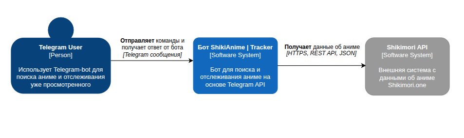
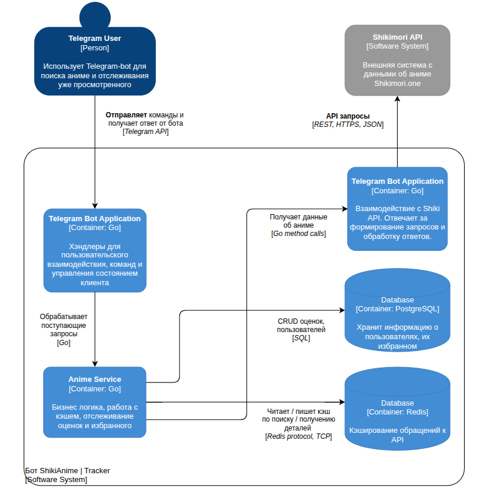
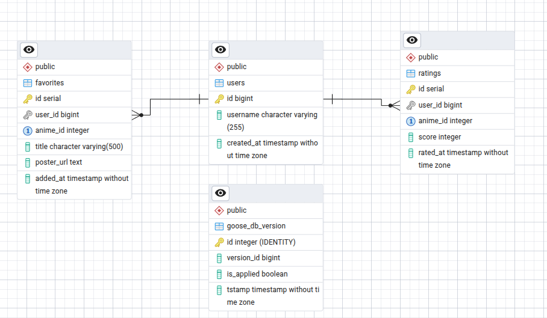

# Telegram-бот для отслеживания аниме ShikiAnime 
## Введение

### Автор
```
Златов Владислав - группа 5130904/30102
```

### Определение проблемы
Пользователям, активно следящим за аниме, неудобно каждый раз открывать браузер, заходить на сайт Shikimori.one и искать информацию вручную. Особенно раздражает делать это с мобильного телефона — интерфейс сайта не всегда адаптивен, нужно скроллить, вводить запросы, переключаться между вкладками. Гораздо проще и быстрее получать те же данные прямо в Telegram, где пользователи и так общаются, читают новости и проводят много времени — не выходя из привычного мессенджера.

### Пользовательские сценарии
1. Когда я ищу аниме по названию или ключевым словам, я хочу быстро находить нужные тайтлы с полной и структурированной информацией, включая оценки сообщества, список жанров, статус выпуска, количество эпизодов и качественные постеры, чтобы принимать обоснованное решение о просмотре на основе актуальных и проверенных данных, не переключаясь между разными сайтами и источниками.
2. Когда я нахожу интересное аниме через поиск, я хочу сохранять его в избранное, ставить персональные оценки и просматривать свою подборку, чтобы создавать персонализированную библиотеку просмотренного и запланированного контента, отслеживать свой прогресс и делиться рекомендациями с друзьями, имея быстрый доступ к истории своих оценок и сохраненных тайтлов.


## Архитектура проекта
### Характер нагрузки на сервис
- Оценочное число пользователей: ~3,000 активных пользователей в сутки
- Период хранения данных: не менее 6 лет (для истории оценок и избранного пользователей)
<details>
<summary>Нагрузка на функционал</summary>

- Поиск аниме: 65% 
- Просмотр деталей аниме: 15%
- Добавление в избранное: 12%
- Оценки аниме: 8%
</details>
#### 1. Соотношение R/W нагрузки
- Чтение: ~85% — Преобладают операции поиска аниме, получения детальной информации, просмотра избранного и рейтингов.
- Запись: ~15% — Добавление/удаление из избранного, обновление рейтингов пользователей, кеширование данных.
#### 2. Объёмы трафика

- Средний размер запроса: ~0.3 КБ
- Средний размер ответа: ~8 КБ
- Среднее число запросов на пользователя в сутки: 5
- Общее число операций: `3,000 × 5 = ~15,000 операций/сутки`
- **Входящий** трафик: `3,000 × 5 × 0.3 КБ ≈ 4.5 МБ/сутки`
- **Исходящий** трафик: `3,000 × 5 × 8 КБ ≈ 120 МБ/сутки`
- RPS в среднем: 15,000 / 86,400 ≈ 0.17 RPS
- RPS в пик: 0.17 × 3.5 ≈ 0.6 RPS (вечернее время 18:00-23:00, увеличение в 3-4 раза)

<details>
<summary>Благодаря кэшу в Redis:</summary>

- Поиск кэшируется на 1 час (попадание в кэш ~70%)
- Детали кэшируются на 24 часа (попадание в кэш ~85%)
- Реальные запросы к Shikimori API: ~0.1 RPS (намного ниже лимита 5 запросов/сек)
</details>

#### 3. Объём дисковой системы
##### PostgreSQL (6 лет хранения, с учётом того, что количество пользователей возрастёт):

- users: 25,000 пользователей × 500 байт = 12 МБ
- favorites: 25,000 пользователей × 40 аниме × 200 байт = 200 МБ
- ratings: 25,000 пользователей × 25 оценок × 150 байт = 94 МБ

Индексы: ~40% от данных = 122 МБ

Служебные данные: 50 МБ

Итоговый объём базы данных за 6 лет с учётом индексов: **~478 МБ**. Для запаса рекомендуется выделить 2 ГБ дискового пространства.

##### Redis (кэш в памяти):

- Активные кэши за 24 часа: 5-10 МБ


#### 4. C4-диаграммы
##### C4-context


##### C4-container


#### 5. Контраĸты API + нефунĸциональные требования
Используемые методы Shikimori API:
```
GET /api/animes - Ожидаемое время: < 500 мс
200
[
  {
    "id": 56,
    "name": "Test",
    "russian": "аниме_56",
    "image": {
      "original": "/assets/globals/missing_original.jpg",
      "preview": "/assets/globals/missing_preview.jpg",
      "x96": "/assets/globals/missing_x96.jpg",
      "x48": "/assets/globals/missing_x48.jpg"
    },
    "url": "/animes/56-test",
    "kind": "tv",
    "score": "8.0",
    "status": "released",
    "episodes": 0,
    "episodes_aired": 0,
    "aired_on": "2014-01-01",
    "released_on": null
  }
]
```
```
GET /api/animes/50 - Ожидаемое время: < 300 мс
200
{
  "id": 50,
  "name": "anime_50",
  "russian": "аниме_50",
  "image": {
    "original": "/assets/globals/missing_original.jpg",
    "preview": "/assets/globals/missing_preview.jpg",
    "x96": "/assets/globals/missing_x96.jpg",
    "x48": "/assets/globals/missing_x48.jpg"
  },
  "url": "/animes/50-anime-50",
  "kind": "tv",
  "score": "1.0",
  "status": "released",
  "episodes": 0,
  "episodes_aired": 0,
  "aired_on": null,
  "released_on": null,
  "rating": "pg_13",
  "english": [
    null
  ],
  "japanese": [
    null
  ],
  "synonyms": [],
  "license_name_ru": null,
  "duration": 0,
  "description": null,
  "description_html": "<div class=\"b-text_with_paragraphs\"></div>",
  "description_source": null,
  "franchise": null,
  "favoured": false,
  "anons": false,
  "ongoing": false,
  "thread_id": 270127,
  "topic_id": 270127,
  "myanimelist_id": 50,
  "rates_scores_stats": [],
  "rates_statuses_stats": [],
  "updated_at": "2022-11-26T17:19:33.411+03:00",
  "next_episode_at": null,
  "fansubbers": [],
  "fandubbers": [],
  "licensors": [],
  "genres": [],
  "studios": [],
  "videos": [],
  "screenshots": [],
  "user_rate": null
}
```
Внутренние операции с БД:
```
Добавление в избранное
  - Запись в таблицу favorites
  - Ожидаемое время: < 200 мс

Оценка аниме
  - Запись в таблицу ratings
  - Ожидаемое время: < 200 мс

Получение списка избранного
  - Чтение из таблицы favorites
  - Ожидаемое время: < 400 мс

Получение оценок пользователя
  - Чтение из таблицы ratings
  - Ожидаемое время: < 400 мс
```
#### 6. Схема БД


Архитектура БД ориентирована на интенсивные операции чтения. Примененные индексы обеспечивают соответствие системы требованиям к производительности и времени отклика.


#### 7. Масштабирование (при x10 в нагрузке)

При 30,000 пользователей в сутки и 6 запросов/сек в пик:

**1. Горизонтальное масштабирование приложения:**
- Запустить 3-5 копий Go-бота за балансировщиком нагрузки (nginx)
- Каждая копия обрабатывает свою часть запросов независимо

**2. Масштабирование Redis:**
- Использовать 3 сервера Redis для распределения кэша
- Добавить резервные копии Redis для надёжности

**3. Масштабирование PostgreSQL:**
- 1 основная база для записи + 2-3 копии для чтения
- Разделить большие таблицы на части по user_id

**4. Вертикальное масштабирование:**
- Увеличить ресурсы серверов: PostgreSQL (16 процессоров, 64 ГБ памяти), Redis (8 ГБ памяти)

---

## Тестирование
Запуск тестирования и приложения:

```bash
docker compose up -d 
docker compose -f docker-compose.test.yml up --build --abort-on-container-exit
```

Контейнер init автоматически выполняет все проверки (сборка, тесты). Контейнер app запускается только если все тесты прошли успешно.

Остановка:

```bash
docker compose down
```

Полная очистка данных:

```bash
docker compose down -v
```

Просмотр логов инициализации:

```bash
docker compose logs init
```

Просмотр логов приложения:

```bash
docker compose logs app
```

Структура тестов:

- internal/ - юнит тесты для компонентов проекта
- tests/e2e/ - полный сценарий поиска аниме
- tests/integration/ - тесты интеграции компонентов с БД и Redis


